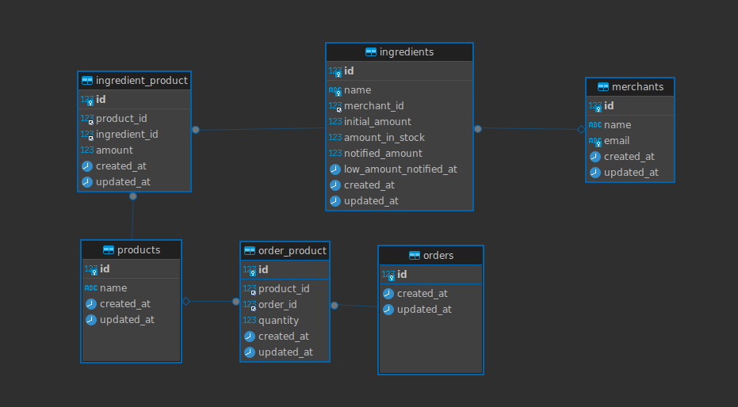

# Order processing workflow - API
    
This API can :
- Accepts the order details from the request payload.
- Persists the Order in the database.
- Updates the stock of the ingredients.
- Implement an email notification system that triggers an email once the stock level of any ingredient falls below 50%.


## Installation

#### Requirements
- PHP 8.1 or greater
- Composer 2.2 or greater
- MySQL 5.7 or greater
- Docker Desktop
- Any web server such as Apache, Nginx, or IIS

#### Run Using Sail 
To serve this API run :
```bash
  ./vendor/bin/sail up
```
Show [API Documentation](https://www.postman.com/acairo/workspace/public/collection/24549944-a8ae15ea-8f5b-42dc-b5aa-18084d989814?action=share&creator=24549944&active-environment=24549944-9242ac10-29de-43d1-8bcf-5e2212fbecb9)


## Problems and Challenges

#### Problem 1: Handling order persistence and ingredient stock updates

 __Challenge :__ Effectively create a new order record in the database and simultaneously update the stock levels of the corresponding ingredients while ensuring data consistency and `preventing race conditions`.

 __Soluation:__
- Implement database transactions 
- Utilize optimistic locking mechanism to prevent concurrent orders 
- Handled within a single atomic transaction
- Implement a retry mechanism using a loop and exception handling.

---

#### Problem 2: Implementing email notifications for low ingredient stock

__Challenge:__ Monitoring ingredient stock levels, triggering email notifications when any ingredient's stock falls below 50%, and `preventing duplicate notifications` for the same ingredient.

__Soluation:__ 
- Use the `amount_in_stock` and `notified_amount` fields to monitor ingredient stock levels
- Use the `low_amount_notified_at` field to prevent duplicate email notifications

---

#### Problem 3: Writing comprehensive test cases

__Challenge:__ Writing thorough test cases to validate order persistence, ingredient stock updates, and email notification behavior.

__Soluation:__
Covering various order scenarios with different quantities and ingredients using Pest.
Verifying accurate ingredient stock level updates.
Asserting that email notifications are sent only when necessary.


---
## Database ERD
<p align="center" width="100%">
    
</p>

---
> **Note**
> This repository is an practice workspace  and is not meant to be used for any development purposes.


